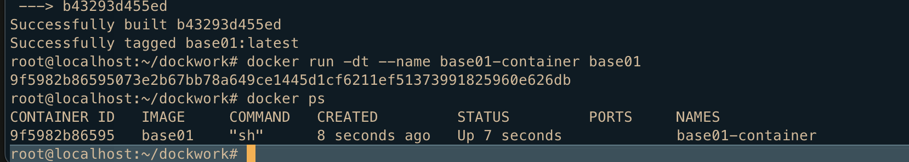
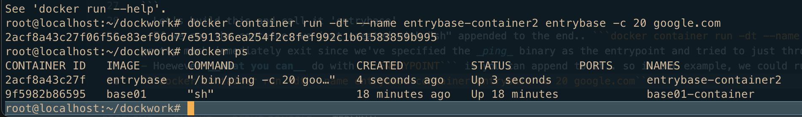

### Overview of ENTRYPOINT and CMD
- The best use for [ENTRYPOINT](https://docs.docker.com/engine/reference/builder/#entrypoint) is to set the image's main command
- ```ENTRYPOINT``` doesn't allow you to override the command
- ```CMD``` and ```ENTRYPOINT``` can be used together but are distinct 
- Take the example below:
```
(Dockerfile)
FROM busybox
CMD ["sh"]
```
- If we build and run the above by ```docker build -t base01 .``` Then run it with ```docker run -dt --name base01-container base01```
and then we do a ```docker ps``` we will see:




- But because the ```CMD``` is _**override-able**_ we can just as easily build a new container with the following command, which will work fine:
```docker container run -dt --name base02 base01 ping -c 10 google.com``` 
- This overrides our initial "sh" (shell prompt) command with a command to ping when the container starts now.
- What is interesting about our overwritten ```CMD``` (replacing just ```sh``` with ```ping -c 10 google.com```) is that when you immediately ```docker ps``` to check that container it will be present .. but after a few seconds (after it has time to ping 10 times) it will then exit... while the original ```base01-cotainer``` is still running off it's ```sh``` command

- However ```ENTRYPOINT``` cannot be overriden during __runtime__ like ```CMD``` can
- For instance take a look at this container we construct with a ```Dockerfile```
```
FROM busybox
ENTRYPOINT ["/bin/ping"]
```
- Let's build this and call it 'entrybase'
- If we run the container we just created with "sh" appended to the end.. ```docker container run -dt --name entrybase-container entrybase sh``` the container __will__ start .. but will pretty much immediately exit since we've specified the _ping_ binary as the entrypoint and tried to just throw a shell on that somehow .. it wont' work and the container exits..
- Hoewever __what you can__ do with ```ENTRYPOINT``` is you can append to it.. so in our example, we could run the following and it will append a 20 try ping request to google on the end
```docker container run -dt --name entrybase-container entrybase -c 20 google.com``` and we see the following: **Notice how we've successfully appended to , but CAN NOT override the ```ENTRYPOINT```** 



- **CMD / ENTRYPOINT IN KUBERNETES**: 
- An important matrix to remember in Kubernetes is that the docker field ```ENTRYPOINT``` in Kubernetes should be treated as the ```command``` field.. and ```CMD``` in Kubernetes should be treated as the ```args``` .. The entrypoint being the command that will be run by the cointainer and the args being those passed to the container.