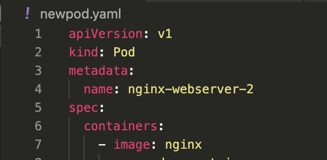

## Bits and Pieces of Info on Pods in K8's system
- A [pod](https://kubernetes.io/docs/concepts/workloads/pods/) will always run on a [Node](https://kubernetes.io/docs/concepts/architecture/nodes/). **This is great because I had been wondering where the pods we were creating were running .. It won't explicitly say _which_ Node is running the pod, but one of them is**
- A [Node](https://kubernetes.io/docs/concepts/architecture/nodes/) is a worker machine _virtual or physical_ in Kubernetes (already stated.. just noting for reference)
- Each Node is managed by the _'Master'_ -> **This is still a little ambiguous to me because I don't see a dedicated machine labeled as 'Master' separate from the worker-nodes .. So I have a feeling this is synonymous with the [Control Plane](https://kubernetes.io/docs/concepts/architecture/controller/) which isn't a physical or virtual machine by itself _per se_**
- A Node can have multiple pods.
- Coming back to my above question about what is the 'control-plane' and what is the 'master' .. Now I think since you must have at least 1 node to have a k8 cluster.. that 1 node would therefore be the master node. So it *is* one of the nodes.
- [Here is another great article](https://subscription.packtpub.com/book/cloud-and-networking/9781838827694/3/ch03lvl1sec10/understanding-the-difference-between-the-master-and-worker-nodes) 


- Pods can also be quickly created via the command-line with the following format: ```kubectl run [POD NAME] --image=[IMAGE NAME]``` like ```kubectl run nginx-webserver-2 --image=nginx``` to create the same thing as the following yaml manifest would:

