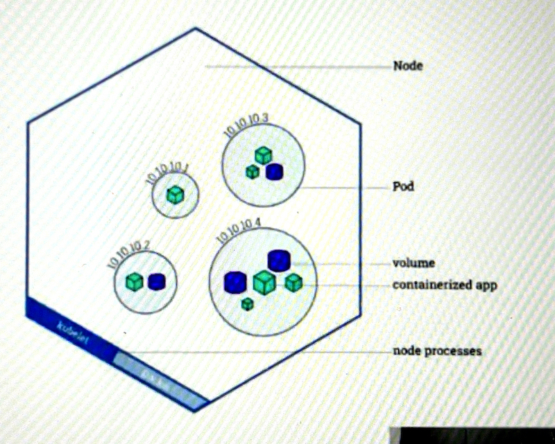

## Bits and Pieces of Info on Pods in K8's system
- A [pod](https://kubernetes.io/docs/concepts/workloads/pods/) will always run on a [Node](https://kubernetes.io/docs/concepts/architecture/nodes/). **This is great because I had been wondering where the pods we were creating were running .. It won't explicitly say _which_ Node is running the pod, but one of them is**
- A [Node](https://kubernetes.io/docs/concepts/architecture/nodes/) is a worker machine _virtual or physical_ in Kubernetes (already stated.. just noting for reference)
- Each Node is managed by the _'Master'_ -> **This is still a little ambiguous to me because I don't see a dedicated machine labeled as 'Master' separate from the worker-nodes .. So I have a feeling this is synonymous with the [Control Plane](https://kubernetes.io/docs/concepts/architecture/controller/) which isn't a physical or virtual machine by itself _per se_**
- A Node can have multiple pods.

